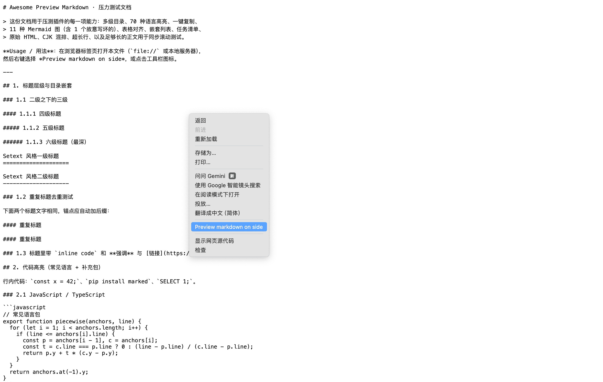
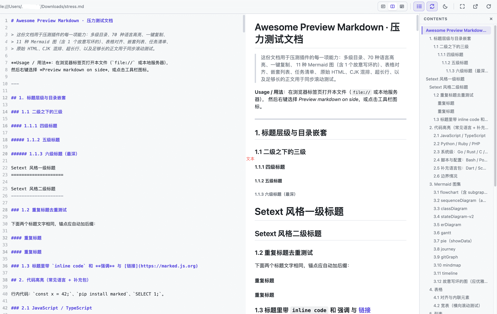
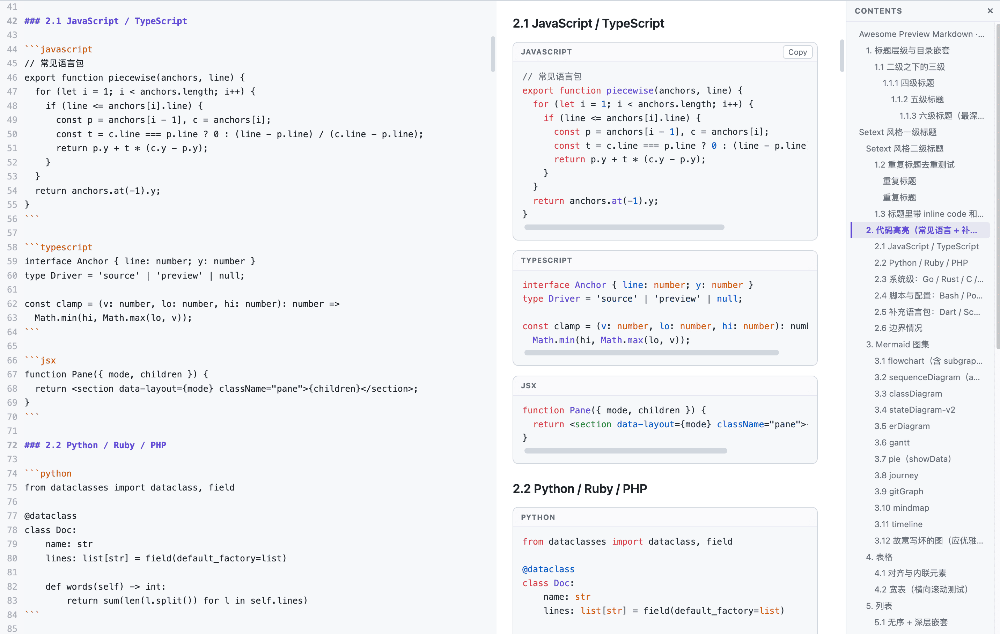
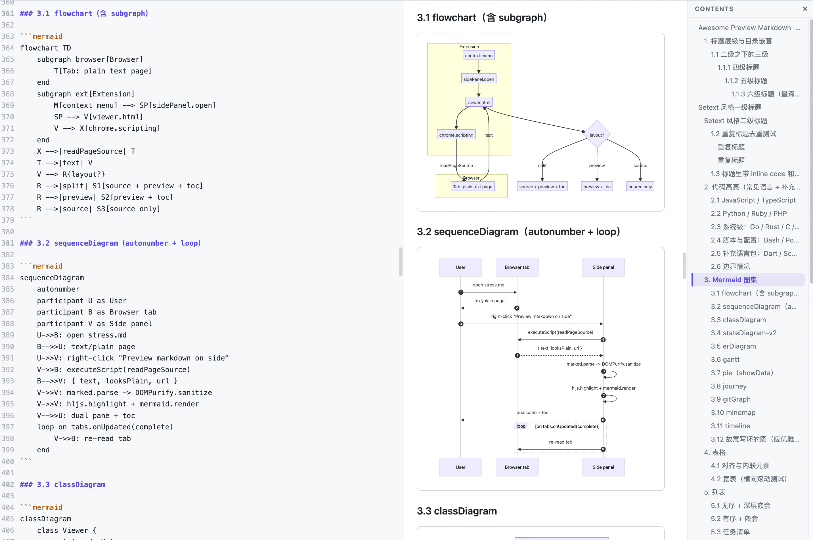
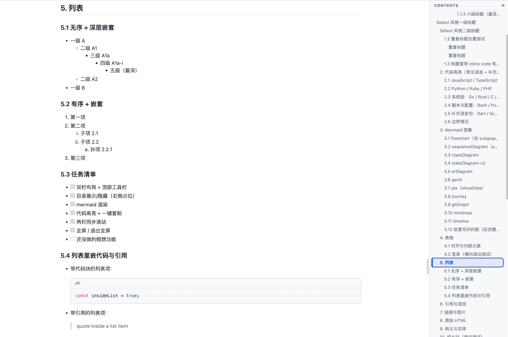

# Awesome Preview Markdown

[English](README.md) | **简体中文**

一个 Chrome 扩展（Manifest V3），以**左右双栏**方式预览本地和远程 Markdown 文件——左侧源码、
右侧渲染预览，并支持目录、Mermaid 图表、代码高亮、一键复制和两栏同步滚动。

核心设计原则：**扩展自身从不打开文件或请求 URL。** 由浏览器在标签页中打开文档
（`file://`、HTTP(S) 网址，或你点击的链接），扩展只读取该标签页已展示的纯文本内容并渲染。
没有文件选择器、没有地址栏、没有拖放、没有后台网络请求。


---

## 功能特性

- **右键预览** —— “Preview markdown on side” 在 Chrome 侧边栏打开文档；点击工具栏图标可预览当前标签页。
- **双栏布局** —— 源码与预览并排，顶部工具栏横跨两栏。支持*仅源码*、*双栏*、*仅预览*三种模式；
  可拖拽分隔条调整宽度，双击分隔条复位到 50%。
- **目录（TOC）** —— 由标题生成，停靠在预览区**右侧**（占据真实布局空间，绝不悬浮遮挡内容），
  带滚动高亮（scroll-spy）和点击跳转，可显隐。
- **Mermaid 图表** —— flowchart、sequence、class、state、ER、Gantt、pie、journey、gitGraph、
  mindmap、timeline。非法图表会内联显示错误、优雅降级，不会拖垮页面。
- **代码高亮 + 复制** —— 通过 highlight.js 支持约 70 种语言，每个代码块带语言标签和一键 **Copy** 按钮。
- **同步滚动** —— 基于块级锚点的分段线性插值，实现源码与预览的双向精确同步行。可开关。
- **全屏与主题** —— 全屏预览切换、明/暗主题切换。
- **状态栏** —— 实时显示文档统计（`行数 · 词数 · KB`）、文件名和阅读位置。
- **带行号的源码栏** —— 粘性行号，并按行做语法着色。
- **记住你的设置** —— 主题、布局、目录开关、同步开关、分隔条位置跨会话持久化（`chrome.storage.local`）。
- **自动跟随标签页** —— 源标签页跳转或刷新时，预览自动重新加载；关闭标签页则回到欢迎页。
- **跟随系统暗色** —— 首次运行时主题按操作系统的明/暗偏好自动判定。
- **全部采用现成库** —— 无构建步骤、无打包器，直接使用 vendored 的 `min.js`/`min.css`。

---

## 界面截图

| | |
|---|---|
| 右键 → **Preview markdown on side**（双栏） |  |
| 布局模式 + 可拖拽分隔条 |  |
| 多语言代码高亮 + 一键复制 |  |
| Mermaid 图表 |  |
| 全屏预览 + 目录 |  |

---

## 安装（加载已解压的扩展程序）

1. 克隆或下载本仓库。
2. 打开 Chrome，进入 `chrome://extensions`。
3. 打开右上角的 **开发者模式 / Developer mode**。
4. 点击 **加载已解压的扩展程序 / Load unpacked**，选择**本仓库的根目录**（即包含 `manifest.json` 的目录）。
5. 将扩展图标固定到工具栏，方便使用。

> **预览本地 `file://` Markdown：** 在 `chrome://extensions` 中该扩展的卡片上点击**详情 / Details**，
> 开启**允许访问文件网址 / Allow access to file URLs**。远程 `http(s)://` 文件无需额外设置。

---

## 使用方法

**先在浏览器标签页中打开一个 Markdown 文档**，然后再预览：

- 在页面上右键 → **Preview markdown on side**，或
- 当当前标签页是 Markdown 时，点击**工具栏图标**。

如果你右键的是指向 Markdown 文件的*链接*，扩展会在新的后台标签页打开它
（并把 GitHub 的 `blob` 链接改写为 `raw.githubusercontent.com`），然后进行预览。

预览在 Chrome 的**侧边栏**中打开；若侧边栏无法打开，则回退为在当前窗口新开一个标签页显示预览。

### 键盘快捷键（焦点在预览面板时）

| 按键 | 功能 |
|------|------|
| `1` | 仅源码布局 |
| `2` | 双栏布局 |
| `3` | 仅预览布局 |
| `T` | 显示/隐藏目录 |
| `S` | 开关同步滚动 |
| `F` | 切换全屏 |
| `D` | 切换明/暗主题 |

工具栏按钮覆盖以上全部功能，另含**重新加载**。

---

## 工作原理

- `background.js` —— service worker：构建右键菜单、打开/规范化标签页、打开侧边栏（失败时回退为在当前窗口新开标签页）。
- `viewer.js` —— 通过 `chrome.scripting` 向目标标签页注入一小段读取脚本，取回纯文本 Markdown，
  再依次用 **marked** 渲染 → **DOMPurify** 消毒 → **highlight.js** 高亮 → **mermaid** 画图。
  同步滚动由 marked token 流计算出的逐块 `data-line` 锚点驱动。
- 扩展只读取浏览器已经展示的内容。对 HTML（非 Markdown）标签页，显示引导提示条而非报错。

---

## 权限说明

| 权限 | 用途 |
|------|------|
| `contextMenus` | “Preview markdown on side” 菜单项。 |
| `sidePanel` | 承载预览界面。 |
| `scripting` | 读取当前标签页的纯文本 Markdown 内容。 |
| `storage` | 记住待预览目标和你的布局/主题偏好。 |
| `clipboardWrite` | 代码块的 **Copy** 按钮。 |
| `host_permissions: <all_urls>` | 允许预览你在任意站点或本地打开的 Markdown。 |

扩展**不**发起任何自身的网络请求，也不向任何地方发送数据。

---

## 项目结构

```
awesome-preview-markdown/
├─ manifest.json          # MV3 清单
├─ background.js          # service worker（菜单、标签页、面板）
├─ viewer.html/css/js     # 预览界面
├─ icons/                 # 16 / 48 / 128 px 图标
├─ vendor/                # 打包的 min.js / min.css 库 + LICENSES.md
├─ samples/               # 手动测试用的本地 Markdown
├─ docs/                  # GitHub Pages 落地页 + 资源
├─ scripts/               # 打包脚本（生成发布用压缩包）
├─ TEST_CASES.md          # 手动测试清单（本地 + 线上）
├─ CHANGELOG.md
├─ NOTICE.md              # 第三方署名
└─ LICENSE                # Apache-2.0
```

---

## 测试

本项目采用**手动测试清单**（无构建/测试工具）。本地文件与线上网址的用例见
[`TEST_CASES.md`](TEST_CASES.md)，其中包含一个覆盖所有渲染特性的压力文档（`samples/stress.md`）。

本地快速运行：

```bash
python3 -m http.server 8765
# 在标签页打开 http://localhost:8765/samples/stress.md，然后进行预览
```

---

## 发布打包

生成一个**只含插件运行所需内容**的发布压缩包（运行文件 + 用于许可合规的 `LICENSE`/`NOTICE.md`）；
`samples/`、`docs/`、`scripts/` 及各类 Markdown 文档都会被排除。

```bash
./scripts/package.sh
# → dist/awesome-preview-markdown-v<version>.zip（manifest.json 位于压缩包根目录）
```

版本号从 `manifest.json` 读取。该 zip 可直接上传 Chrome 应用商店，或解压后用于「加载已解压的扩展程序」。

---

## 第三方库

marked、DOMPurify、highlight.js、mermaid、github-markdown-css。版本与许可见
[`NOTICE.md`](NOTICE.md) 和 [`vendor/LICENSES.md`](vendor/LICENSES.md)。

---

## 许可证

Apache License 2.0 —— 见 [`LICENSE`](LICENSE)。
