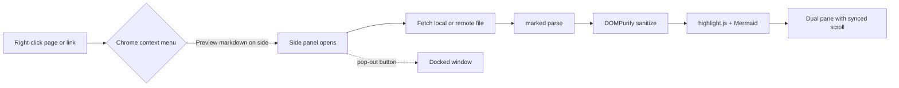
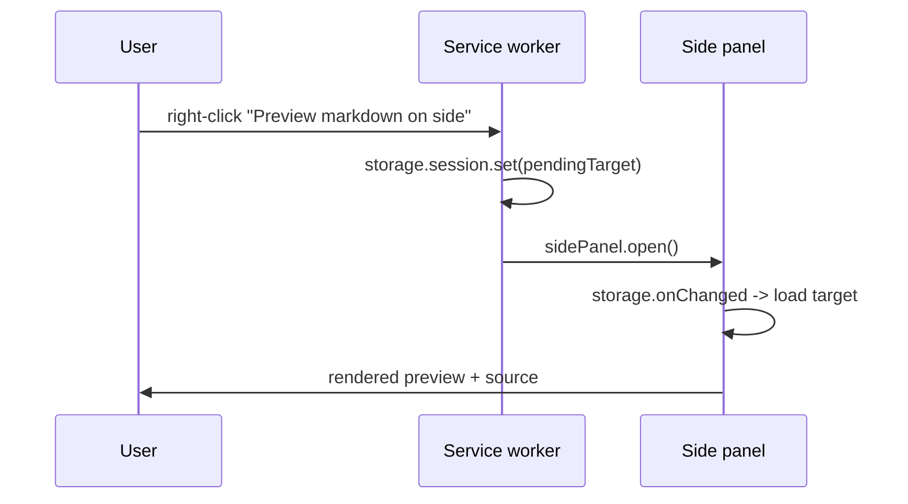
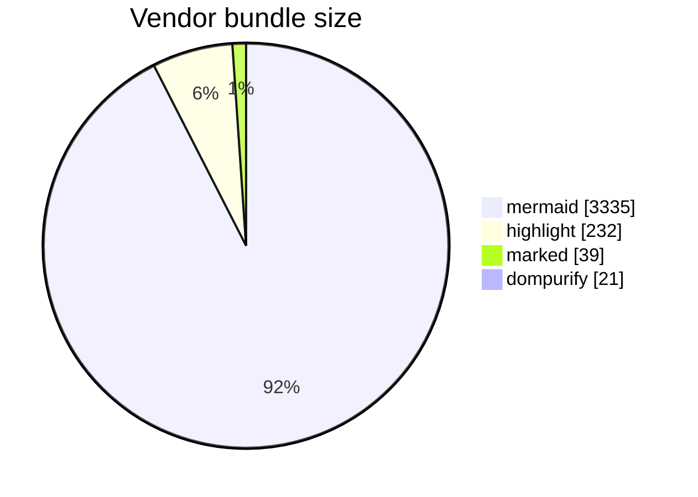

# Awesome Preview Markdown

A sample document used to exercise every feature of the viewer: table of
contents, syntax highlighting for common languages, one-click copy, Mermaid
diagrams, and two-pane synced scrolling.

> **Tip:** open this file with the extension's right-click menu
> "Preview markdown on side", then press the pop-out button for a wide
> two-column view.

---

## 1. Code highlighting

Inline code looks like `const x = 42;` and fenced blocks get a language label
plus a copy button.

```javascript
// javascript
async function fetchMarkdown(url) {
  const res = await fetch(url, { redirect: 'follow' });
  if (!res.ok) throw new Error(`HTTP ${res.status}`);
  return res.text();
}
```

```python
# python
from dataclasses import dataclass

@dataclass
class Heading:
    depth: int
    text: str
    line: int

def build_toc(headings: list[Heading]) -> dict:
    return {h.text: h.line for h in headings if h.depth <= 3}
```

```rust
// rust
fn line_to_y(line: f64, tops: &[f64]) -> f64 {
    let i = line.floor() as usize;
    if i + 1 >= tops.len() { return *tops.last().unwrap(); }
    tops[i] + (line - i as f64) * (tops[i + 1] - tops[i])
}
```

```go
package main

import "fmt"

func main() {
    fmt.Println("go is highlighted too")
}
```

```java
public class Sync {
    private static final int THRESHOLD = 120;
    public static void main(String[] args) {
        System.out.println("hello");
    }
}
```

```cpp
#include <vector>
#include <algorithm>

std::vector<int> sorted(std::vector<int> v) {
    std::sort(v.begin(), v.end());
    return v;
}
```

```typescript
interface Anchor { line: number; y: number }

export function interpolate(anchors: Anchor[], line: number): number {
  return anchors.find((a) => a.line >= line)?.y ?? 0;
}
```

```csharp
using System.Linq;

public record TocItem(string Text, int Depth);

public static class Toc
{
    public static int Count(IEnumerable<TocItem> items) => items.Count();
}
```

```bash
#!/usr/bin/env bash
set -euo pipefail
for f in vendor/*.min.js; do
  echo "$(wc -c < "$f") $f"
done
```

```sql
SELECT id, title, line
FROM headings
WHERE depth <= 3
ORDER BY line ASC
LIMIT 10;
```

```json
{
  "manifest_version": 3,
  "permissions": ["contextMenus", "sidePanel", "storage"],
  "side_panel": { "default_path": "viewer.html" }
}
```

```yaml
name: build
on: [push]
jobs:
  test:
    runs-on: ubuntu-latest
    steps:
      - uses: actions/checkout@v4
```

```dockerfile
FROM node:20-alpine
WORKDIR /app
COPY package*.json ./
RUN npm ci --omit=dev
CMD ["node", "server.js"]
```

```kotlin
data class Doc(val name: String, val lines: Int)

fun Doc.summary(): String = "$name ($lines lines)"
```

```swift
struct Anchor {
    let line: Int
    let y: CGFloat
}

func interpolate(_ anchors: [Anchor], line: Int) -> CGFloat {
    anchors.first { $0.line >= line }?.y ?? 0
}
```

```php
<?php
function slugify(string $text): string {
    return trim(preg_replace('/\s+/', '-', strtolower($text)));
}
```

```ruby
class Toc
  def initialize(headings) = @headings = headings
  def top_level = @headings.select { |h| h[:depth] == 1 }
end
```

### Unknown language falls back to auto-detection

```
plain block with no language tag at all
just some text that may or may not be detected
```

## 2. Mermaid diagrams

### Flowchart



### Sequence diagram



### Pie chart



### Broken diagram degrades gracefully

```mermaid
flowchart LR
    A[unclosed
```

## 3. Tables

| Language   | Highlighted | Notes                        |
| ---------- | :---------: | ---------------------------- |
| JavaScript |     yes     | common bundle                |
| Python     |     yes     | common bundle                |
| Dart       |     yes     | extra pack                   |
| Zig        |     no      | not shipped by hljs 11.9.0   |

## 4. Lists and tasks

1. Ordered item one
2. Ordered item two
   1. Nested ordered
   2. Nested ordered

- Unordered item
- Another item
  - Nested

- [x] Synced scrolling
- [x] Table of contents toggle
- [ ] Something still open

## 5. Headings for the TOC

### Third level heading

Some body text so the pane is scrollable.

#### Fourth level heading

More text.

##### Fifth level heading

Even more text.

## 6. Mixed content

Here is a link to [the marked documentation](https://marked.js.org) and an
image reference:


<details>
<summary>Raw HTML block</summary>

Raw HTML passes through DOMPurify, so `<script>` is stripped but formatting
survives.

</details>

## 7. Long section for scroll testing

Paragraph one. Lorem ipsum dolor sit amet, consectetur adipiscing elit, sed do
eiusmod tempor incididunt ut labore et dolore magna aliqua.

Paragraph two. Ut enim ad minim veniam, quis nostrud exercitation ullamco
laboris nisi ut aliquip ex ea commodo consequat.

Paragraph three. Duis aute irure dolor in reprehenderit in voluptate velit
esse cillum dolore eu fugiat nulla pariatur.

Paragraph four. Excepteur sint occaecat cupidatat non proident, sunt in culpa
qui officia deserunt mollit anim id est laborum.

Paragraph five. Sed ut perspiciatis unde omnis iste natus error sit voluptatem
accusantium doloremque laudantium.

### End of document

That is the last heading — the TOC should highlight it once you scroll here.
