# Awesome Preview Markdown · 压力测试文档

> 这份文档用于压测插件的每一项能力：多级目录、70 种语言高亮、一键复制、
> 11 种 Mermaid 图（含 1 个故意写坏的）、表格对齐、嵌套列表、任务清单、
> 原始 HTML、CJK 混排、超长行、以及足够长的正文用于同步滚动测试。

**Usage / 用法**：在浏览器标签页打开本文件（`file://` 或本地服务器），
然后右键选择 *Preview markdown on side*，或点击工具栏图标。

---

## 1. 标题层级与目录嵌套

### 1.1 二级之下的三级

#### 1.1.1 四级标题

##### 1.1.2 五级标题

###### 1.1.3 六级标题（最深）

Setext 风格一级标题
====================

Setext 风格二级标题
--------------------

### 1.2 重复标题去重测试

下面两个标题文字相同，锚点应自动加后缀：

#### 重复标题

#### 重复标题

### 1.3 标题里带 `inline code` 和 **强调** 与 [链接](https://marked.js.org)

## 2. 代码高亮（常见语言 + 补充包）

行内代码：`const x = 42;`、`pip install marked`、`SELECT 1;`。

### 2.1 JavaScript / TypeScript

```javascript
// 常见语言包
export function piecewise(anchors, line) {
  for (let i = 1; i < anchors.length; i++) {
    if (line <= anchors[i].line) {
      const p = anchors[i - 1], c = anchors[i];
      const t = c.line === p.line ? 0 : (line - p.line) / (c.line - p.line);
      return p.y + t * (c.y - p.y);
    }
  }
  return anchors.at(-1).y;
}
```

```typescript
interface Anchor { line: number; y: number }
type Driver = 'source' | 'preview' | null;

const clamp = (v: number, lo: number, hi: number): number =>
  Math.min(hi, Math.max(lo, v));
```

```jsx
function Pane({ mode, children }) {
  return <section data-layout={mode} className="pane">{children}</section>;
}
```

### 2.2 Python / Ruby / PHP

```python
from dataclasses import dataclass, field

@dataclass
class Doc:
    name: str
    lines: list[str] = field(default_factory=list)

    def words(self) -> int:
        return sum(len(l.split()) for l in self.lines)
```

```ruby
class Toc
  def initialize(headings) = @headings = headings
  def top_level = @headings.select { |h| h[:depth] == 1 }
end
```

```php
<?php
declare(strict_types=1);
function slugify(string $text): string {
    return trim(preg_replace('/\s+/u', '-', mb_strtolower($text)), '-');
}
```

### 2.3 系统级：Go / Rust / C / C++ / C# / Java / Kotlin / Swift

```go
package main

import ("fmt"; "strings")

func main() {
    lines := strings.Split(doc, "\n")
    fmt.Printf("%d lines\n", len(lines))
}
```

```rust
fn line_to_y(line: f64, tops: &[f64]) -> f64 {
    let i = line.floor() as usize;
    match tops.get(i + 1) {
        Some(&next) => tops[i] + (line - i as f64) * (next - tops[i]),
        None => *tops.last().unwrap_or(&0.0),
    }
}
```

```c
#include <stdio.h>
int main(void) { puts("c is highlighted"); return 0; }
```

```cpp
template <typename T>
constexpr T clamp(T v, T lo, T hi) { return v < lo ? lo : (v > hi ? hi : v); }
```

```csharp
public record Anchor(int Line, double Y);
public static double Interpolate(IReadOnlyList<Anchor> a, int line) =>
    a.First(x => x.Line >= line).Y;
```

```java
record Doc(String name, int lines) {}
public final class Main {
    public static void main(String[] args) {
        System.out.println(new Doc("stress.md", 700));
    }
}
```

```kotlin
data class Heading(val depth: Int, val text: String, val line: Int)
fun List<Heading>.topLevel() = filter { it.depth == 1 }
```

```swift
struct Sync { let srcTops: [CGFloat]
    func y(for line: Double) -> CGFloat {
        let i = Int(line.rounded(.down))
        guard i + 1 < srcTops.count else { return srcTops.last ?? 0 }
        return srcTops[i] + CGFloat(line - Double(i)) * (srcTops[i+1] - srcTops[i])
    }
}
```

### 2.4 脚本与配置：Bash / PowerShell / SQL / JSON / YAML / TOML-ish / INI / Dockerfile / Nginx

```bash
#!/usr/bin/env bash
set -euo pipefail
for f in vendor/*.min.js; do
  printf '%8d  %s\n' "$(wc -c < "$f")" "$f"
done
```

```powershell
$files = Get-ChildItem vendor -Filter *.min.js
$files | ForEach-Object { "{0,8}  {1}" -f $_.Length, $_.Name }
```

```sql
SELECT h.depth, COUNT(*) AS n
FROM headings h
WHERE h.line BETWEEN 10 AND 400
GROUP BY h.depth
ORDER BY n DESC;
```

```json
{
  "manifest_version": 3,
  "permissions": ["contextMenus", "sidePanel", "storage", "scripting"],
  "side_panel": { "default_path": "viewer.html" }
}
```

```yaml
name: verify
on: [push]
jobs:
  browser:
    runs-on: ubuntu-latest
    steps:
      - uses: actions/checkout@v4
      - run: python3 -m http.server 8765 &
```

```ini
; ini / .editorconfig 风格
[editor]
indent_style = space
indent_size = 2
```

```dockerfile
FROM node:20-alpine AS build
WORKDIR /app
COPY package*.json ./
RUN npm ci --omit=dev
CMD ["node", "server.js"]
```

```nginx
server {
    listen 8765;
    root /srv/markdown;
    location ~* \.md$ { default_type text/plain; }
}
```

### 2.5 补充语言包：Dart / Scala / Elixir / Haskell / Clojure / Lua / Julia / Matlab / LaTeX / Vim / Protobuf / CMake / Gradle / HTTP / Arduino

```dart
class Anchor { final int line; final double y;
  const Anchor(this.line, this.y); }
```

```scala
case class Heading(depth: Int, text: String, line: Int)
val topLevel = headings.filter(_.depth == 1)
```

```elixir
defmodule Toc do
  def top_level(headings), do: Enum.filter(headings, &(&1.depth == 1))
end
```

```haskell
lineToY :: [(Int, Double)] -> Int -> Double
lineToY ((l, y):_) n | n <= l = y
lineToY (_:rest) n = lineToY rest n
lineToY [] _ = 0
```

```clojure
(defn top-level [headings]
  (filter #(= 1 (:depth %)) headings))
```

```lua
local function clamp(v, lo, hi) return math.min(hi, math.max(lo, v)) end
```

```julia
function interpolate(anchors, line)
    i = searchsortedlast(anchors, line)
    return anchors[max(i, 1)]
end
```

```matlab
function y = lineToY(tops, line)
  i = floor(line) + 1;
  y = tops(i) + (line - i + 1) * (tops(i+1) - tops(i));
end
```

```latex
\documentclass{article}
\begin{document}
\section{Markdown preview}
Rendered by \texttt{marked} + \texttt{DOMPurify}.
\end{document}
```

```vim
function! SyncScroll() abort
  let l:line = line('.')
  execute 'normal! ' . l:line . 'G'
endfunction
```

```protobuf
syntax = "proto3";
message Anchor { int32 line = 1; double y = 2; }
```

```cmake
cmake_minimum_required(VERSION 3.20)
project(markdown_preview NONE)
```

```gradle
plugins { id 'java' }
dependencies { implementation 'com.google.guava:guava:33.0.0-jre' }
```

```http
GET /samples/stress.md HTTP/1.1
Host: localhost:8765
Accept: text/plain
```

```arduino
void setup() { pinMode(LED_BUILTIN, OUTPUT); }
void loop()  { digitalWrite(LED_BUILTIN, HIGH); delay(500); }
```

### 2.6 边界情况

无语言标签（走自动检测）：

```
func guess(x int) int { return x * 2 }
```

未知语言名（回退为纯文本）：

```foobarlang
this language does not exist -> plain escaped text <b>not bold</b>
```

四层反引号围栏里套三层反引号：

````markdown
```js
const inner = 'fence inside fence';
```
````

波浪号围栏：

~~~python
tilde = "fence"
~~~

缩进代码块（4 空格）：

    indented_code_block();
    // marked 会把它识别为 code

代码块内含 HTML 与特殊字符（必须被转义）：

```html
<div class="x" data-a="1 & 2">
  <script>alert('must be escaped &amp; not executed');</script>
</div>
```

## 3. Mermaid 图集

### 3.1 flowchart（含 subgraph）

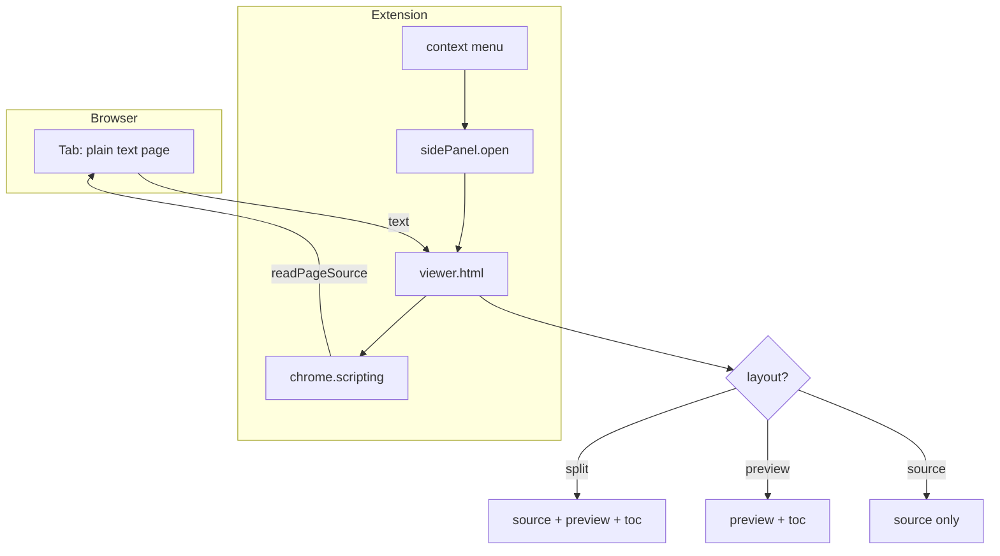

### 3.2 sequenceDiagram（autonumber + loop）

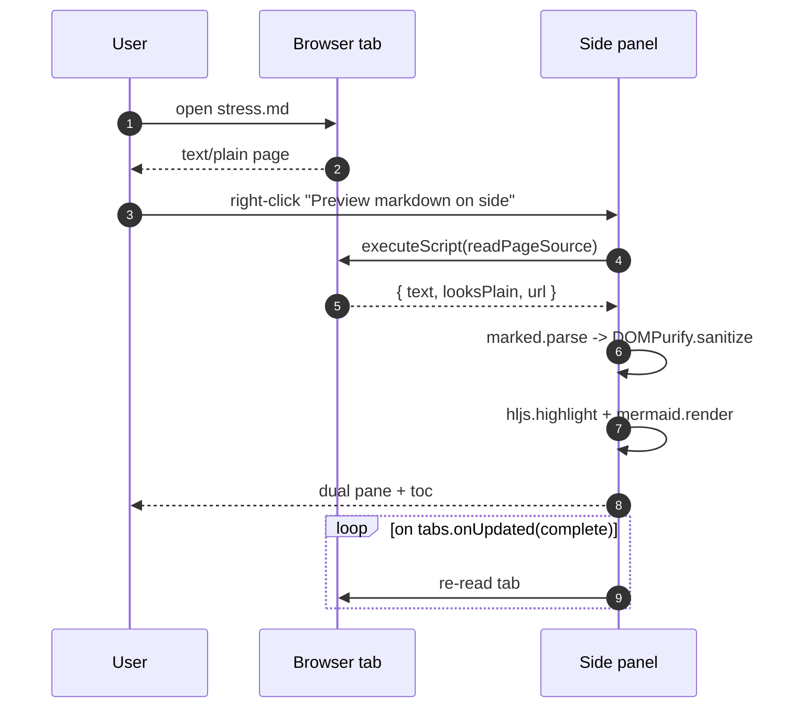

### 3.3 classDiagram

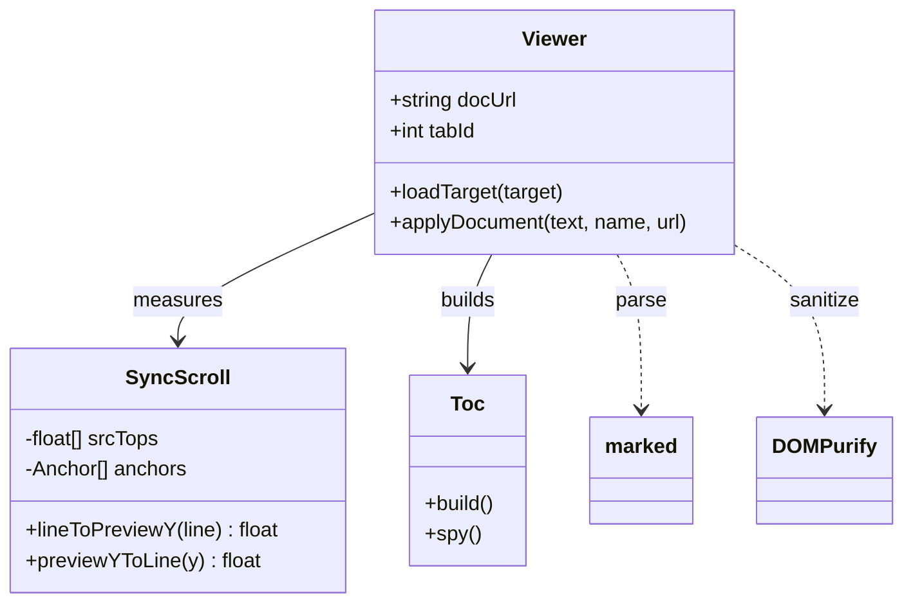

### 3.4 stateDiagram-v2

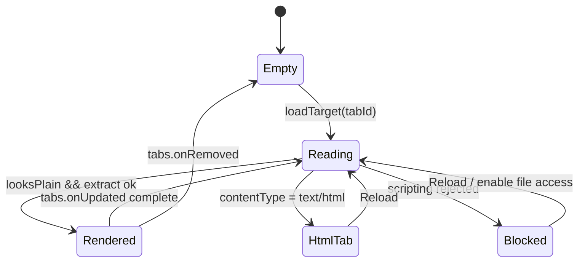

### 3.5 erDiagram

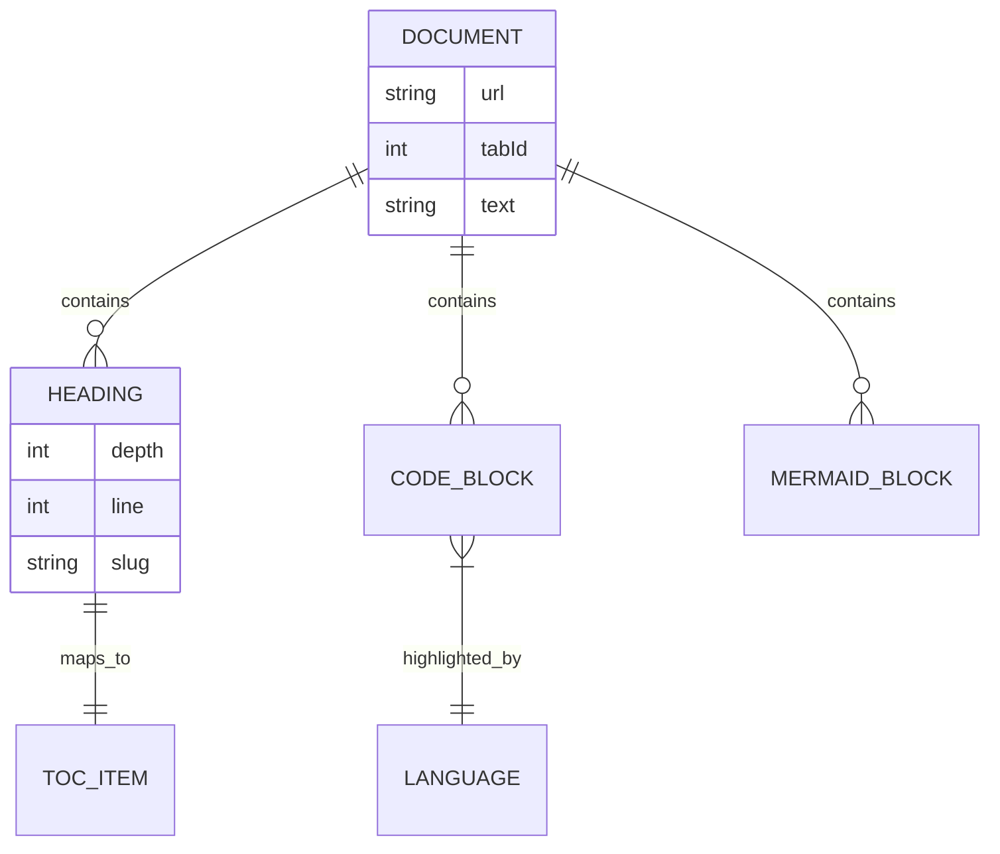

### 3.6 gantt

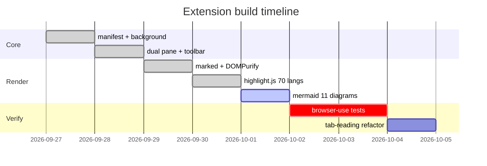

### 3.7 pie（showData）

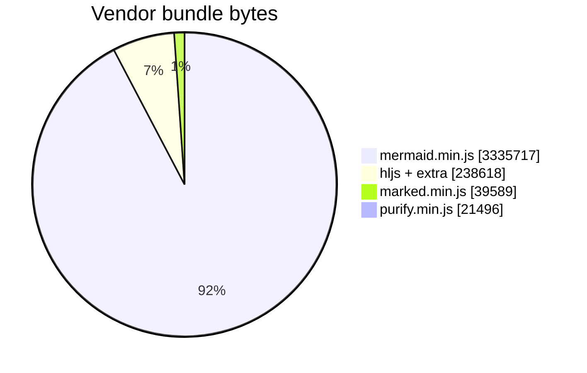

### 3.8 journey

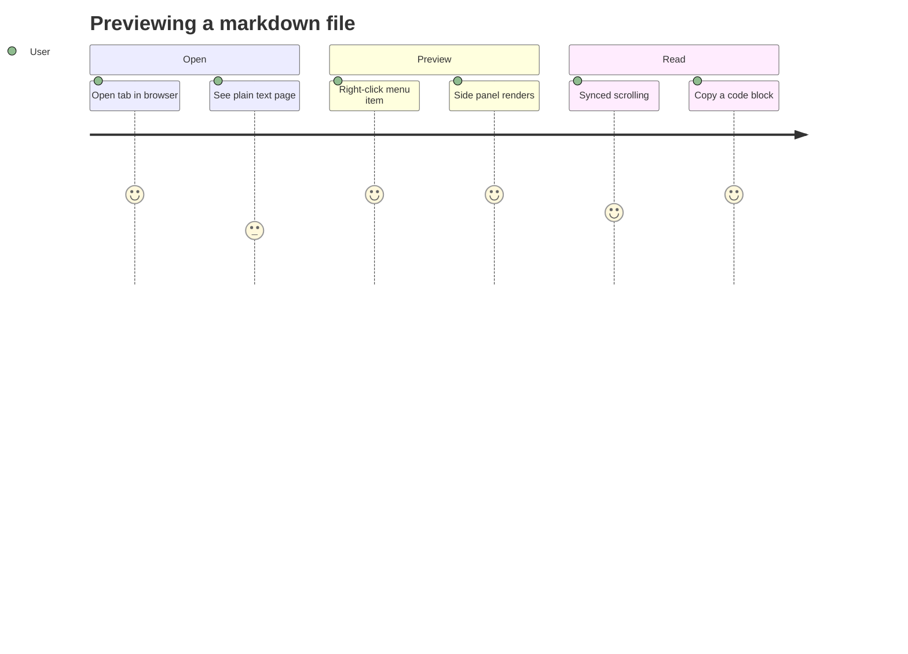

### 3.9 gitGraph

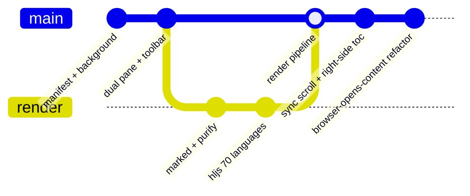

### 3.10 mindmap

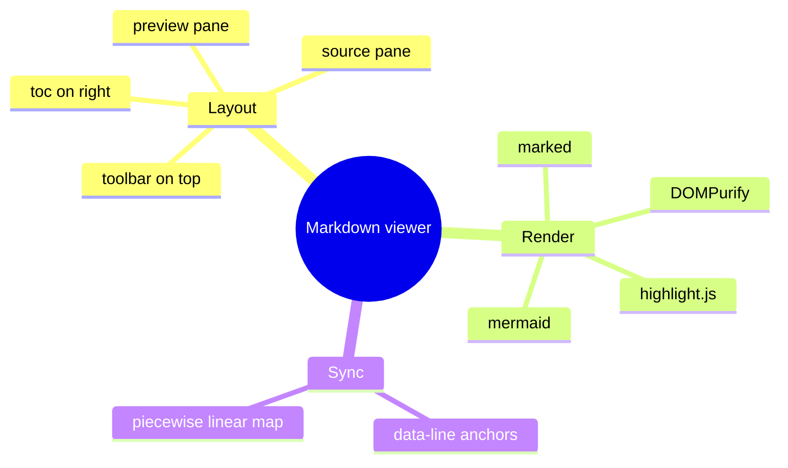

### 3.11 timeline

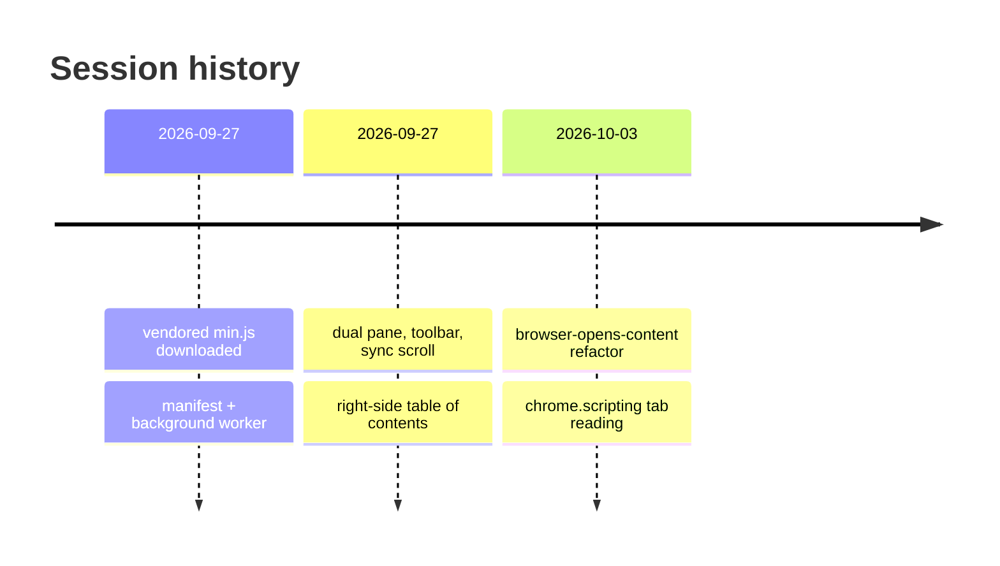

### 3.12 故意写坏的图（应优雅降级为源码 + 报错条）

```mermaid
flowchart LR
    A[this bracket is never closed
```

## 4. 表格

### 4.1 对齐与内联元素

| 左对齐 | 居中 | 右对齐 | 默认 |
| :----- | :--: | -----: | ---- |
| `code` | **bold** | *italic* | ~~strike~~ |
| [link](https://example.com) | 中文 | 123 | 4.5 |
| 含 \| 竖线 | 含 `反引号` | 含 **加粗** | 含 [链接](#4-表格) |

### 4.2 宽表（横向滚动测试）

| col1 | col2 | col3 | col4 | col5 | col6 | col7 | col8 | col9 | col10 |
| ---- | ---- | ---- | ---- | ---- | ---- | ---- | ---- | ---- | ----- |
| aaaa | bbbb | cccc | dddd | eeee | ffff | gggg | hhhh | iiii | jjjj  |
| 1111 | 2222 | 3333 | 4444 | 5555 | 6666 | 7777 | 8888 | 9999 | 0000  |

## 5. 列表

### 5.1 无序 + 深层嵌套

- 一级 A
  - 二级 A1
    - 三级 A1a
      - 四级 A1a-i
        - 五级（最深）
  - 二级 A2
- 一级 B

### 5.2 有序 + 嵌套

1. 第一项
2. 第二项
   1. 子项 2.1
   2. 子项 2.2
      1. 孙项 2.2.1
3. 第三项

### 5.3 任务清单

- [x] 双栏布局 + 顶部工具栏
- [x] 目录展示/隐藏（右侧占位）
- [x] mermaid 渲染
- [x] 代码高亮 + 一键复制
- [x] 两栏同步滚动
- [x] 全屏 / 退出全屏
- [ ] 还没做的假想功能

### 5.4 列表里嵌代码与引用

- 带代码块的列表项：

  ```js
  const insideList = true;
  ```

- 带引用的列表项：

  > quote inside a list item

## 6. 引用与混排

> 一级引用
>
> > 二级嵌套引用
> >
> > > 三级嵌套引用，含 `code` 与 **bold**
>
> 回到一级，带代码块：
>
> ```python
> quoted_code = True
> ```

引用结束后的普通段落。

## 7. 链接与图片

- 自动链接：<https://marked.js.org>
- 带标题的链接：[marked](https://marked.js.org "marked homepage")
- 引用式链接：[ref link][ref1] 与 [ref1][]
- 图片（远程）：

  

- 图片带标题：
- 图片套链接：[](https://example.com)

[ref1]: https://example.com/ref "reference target"

## 8. 原始 HTML

<details>
<summary>点开看原始 HTML 块（DOMPurify 保留格式、剥离脚本）</summary>

<table>
  <tr><th>key</th><th>value</th></tr>
  <tr><td>sanitized</td><td>yes</td></tr>
</table>

<script>alert('must be stripped by DOMPurify');</script>

</details>

行内原始 HTML：<kbd>Ctrl</kbd> + <kbd>Shift</kbd> + <kbd>M</kbd>，
以及 <mark>mark 标签</mark>、<sub>sub</sub>、<sup>sup</sup>。

## 9. 转义与实体

\*这不是斜体\*  \_这不是下划线\_  \`这不是行内代码\`

实体：&amp; &lt; &gt; &copy; &reg; &#65;&#66;&#67; &nbsp; 结束。

硬换行：行尾两个空格  
第二行应紧贴上一行。  
反斜杠换行：\
第三行也应紧贴。

## 10. 超长行（换行测试）

这是一行非常非常长的中文文本，用于测试源码栏在 pre-wrap 下的换行表现以及行号映射是否仍然精确：甲乙丙丁戊己庚辛壬癸子丑寅卯辰巳午未申酉戌亥甲乙丙丁戊己庚辛壬癸子丑寅卯辰巳午未申酉戌亥甲乙丙丁戊己庚辛壬癸子丑寅卯辰巳午未申酉戌亥甲乙丙丁戊己庚辛壬癸子丑寅卯辰巳午未申酉戌亥甲乙丙丁戊己庚辛壬癸子丑寅卯辰巳午未申酉戌亥。

And a very long single-line English sentence to test wrapping in the source pane while keeping the line-number mapping exact for synchronized scrolling between the two panes of the viewer extension.

## 11. 同步滚动长正文

### 11.1 段落 1

Lorem ipsum dolor sit amet, consectetur adipiscing elit, sed do eiusmod tempor
incididunt ut labore et dolore magna aliqua. Ut enim ad minim veniam, quis
nostrud exercitation ullamco laboris nisi ut aliquip ex ea commodo consequat.

### 11.2 段落 2

Duis aute irure dolor in reprehenderit in voluptate velit esse cillum dolore eu
fugiat nulla pariatur. Excepteur sint occaecat cupidatat non proident, sunt in
culpa qui officia deserunt mollit anim id est laborum.

### 11.3 段落 3

Sed ut perspiciatis unde omnis iste natus error sit voluptatem accusantium
doloremque laudantium, totam rem aperiam, eaque ipsa quae ab illo inventore
veritatis et quasi architecto beatae vitae dicta sunt explicabo.

### 11.4 段落 4

Nemo enim ipsam voluptatem quia voluptas sit aspernatur aut odit aut fugit, sed
quia consequuntur magni dolores eos qui ratione voluptatem sequi nesciunt.

### 11.5 段落 5

Neque porro quisquam est, qui dolorem ipsum quia dolor sit amet, consectetur,
adipisci velit, sed quia non numquam eius modi tempora incidunt ut labore et
dolore magnam aliquam quaerat voluptatem.

### 11.6 段落 6

Ut enim ad minima veniam, quis nostrum exercitationem ullam corporis suscipit
laboriosam, nisi ut aliquid ex ea commodi consequatur?

### 11.7 段落 7

Quis autem vel eum iure reprehenderit qui in ea voluptate velit esse quam nihil
molestiae consequatur, vel illum qui dolorem eum fugiat quo voluptas nulla
pariatur?

### 11.8 段落 8

At vero eos et accusamus et iusto odio dignissimos ducimus qui blanditiis
praesentium voluptatum deleniti atque corrupti quos dolores et quas molestias
excepturi sint occaecati cupiditate non provident.

### 11.9 段落 9

Similique sunt in culpa qui officia deserunt mollitia animi, id est laborum et
dolorum fuga. Et harum quidem rerum facilis est et expedita distinctio.

### 11.10 段落 10

Nam libero tempore, cum soluta nobis est eligendi optio cumque nihil impedit
quo minus id quod maxime placeat facere possimus, omnis voluptas assumenda est,
omnis dolor repellendus.

### 11.11 段落 11

Temporibus autem quibusdam et aut officiis debitis aut rerum necessitatibus
saepe eveniet ut et voluptates repudiandae sint et molestiae non recusandae.

### 11.12 段落 12

Itaque earum rerum hic tenetur a sapiente delectus, ut aut reiciendis
voluptatibus maiores alias consequatur aut perferendis doloribus asperiores
repellat.

### 11.13 段落 13

Excepteur sint occaecat cupidatat non proident, sunt in culpa qui officia
deserunt mollit anim id est laborum. Sed ut perspiciatis unde omnis iste natus
error sit voluptatem accusantium doloremque laudantium.

### 11.14 段落 14

Totam rem aperiam, eaque ipsa quae ab illo inventore veritatis et quasi
architecto beatae vitae dicta sunt explicabo. Nemo enim ipsam voluptatem quia
voluptas sit aspernatur aut odit aut fugit.

### 11.15 段落 15

最后一节。滚动到这里时，右侧目录应高亮本条目，左侧源码栏应同步到对应行号。

---

*文档结束 · End of stress document*
